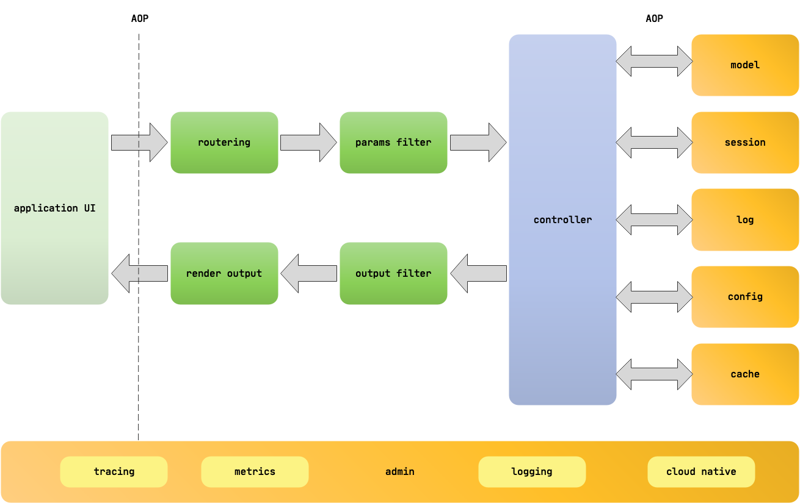
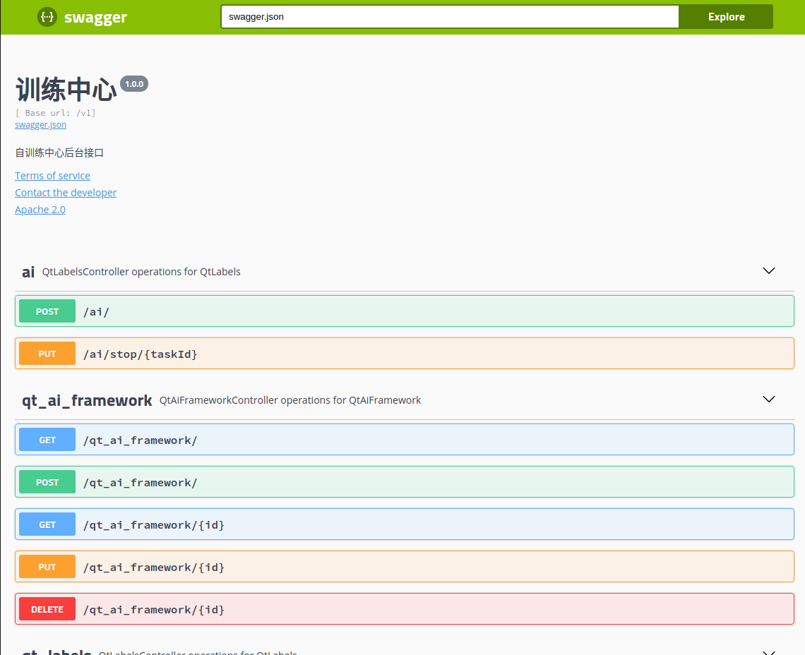
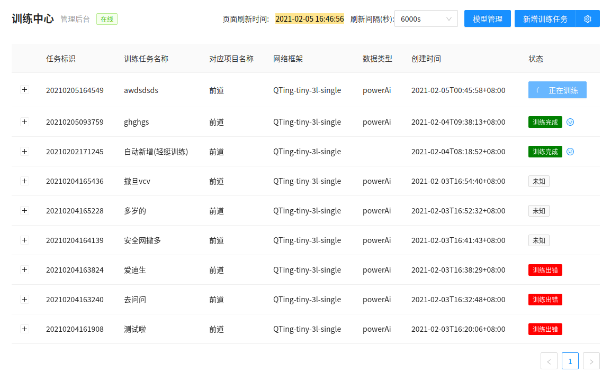

## qting-ai
go版本训练中心 整合了beego 框架，包含API、Web 及后端服务等应用，是一个 RESTful 的框架

### 架构设计

### 执行逻辑


### 接口文档
> 接口内网地址 `http://192.168.31.77:8080/swagger/`



### web demo
> 内网地址 `http://192.168.31.77`



### 插件说明
插件和主进程数据交互都是通过json序列化的数据,`重点说明如果更改了 plugins 包里的代码,所有插件都需要重新编译!!!!`
以下展示插件默认接口，否则无法正确加载

```golang
var (
	pluginName    = "QTing-tiny-3l" // 插件名-对应框架名称
	pluginVersion = 10 // 版本id
)

// 自动加载插件会首先读取版本信息，包含
func Version(args ...interface{}) (ret interface{}, err error) {
	t := plugins.QtPlugins {
		Module:      pluginName,
		VersionCode: pluginVersion,
		Symbol:      "Run", // 该字段就是对应的下面执行的函数
		Args:        "taskId string, projectName string, aiFrameworkName string", // 该字段表示执行函数的参数说明
		PluginName:  args[0].(string),
		CreateTime:  time.Now(),
	}
	res, err := json.Marshal(&t)
	return string(res), err
}
// 框架开始训练执行方法
// ret 默认是返回队列的数据字符串
/*
args[0] 项目结构体Json字符串
args[1] 框架结构体Json字符串
args[2] 训练参数字符串
*/
func Train(args ...interface{}) (ret interface{}, err error) {}

// 训练完成后通用的执行方法
/*
args[0] taskId
args[1] 项目结构体Json字符串
args[2] 框架结构体Json字符串
args[3] 训练任务记录结构体Json字符串
ret 返回[]qtModels数组的Json数据
*/
func Done(args ...interface{}) (ret interface{}, err error) {}

/*
打包发布的方法
args[0] 需要打包的文件字符串数组可以是文件夹
args[1] 需要输出的压缩文件路径
*/
func Compress(args ...interface{}) (ret interface{}, err error) {}
```
         


