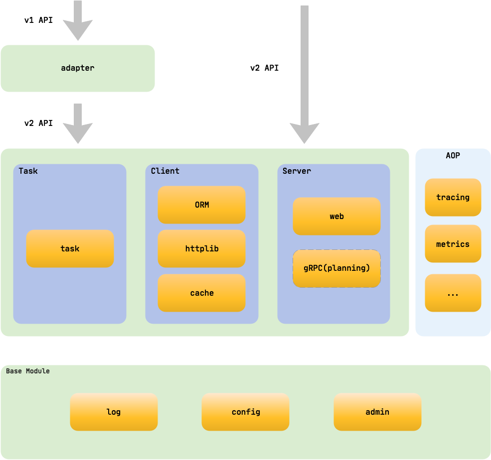

## qting-ai
go版本训练中心 整合了beego 框架，包含API、Web 及后端服务等应用，是一个 RESTful 的框架

### 架构设计

### 执行逻辑

### 接口文档
> 接口内网地址 `http://192.168.31.77:8080/swagger/`

### web demo
> 内网地址 `http://192.168.31.77`

         

